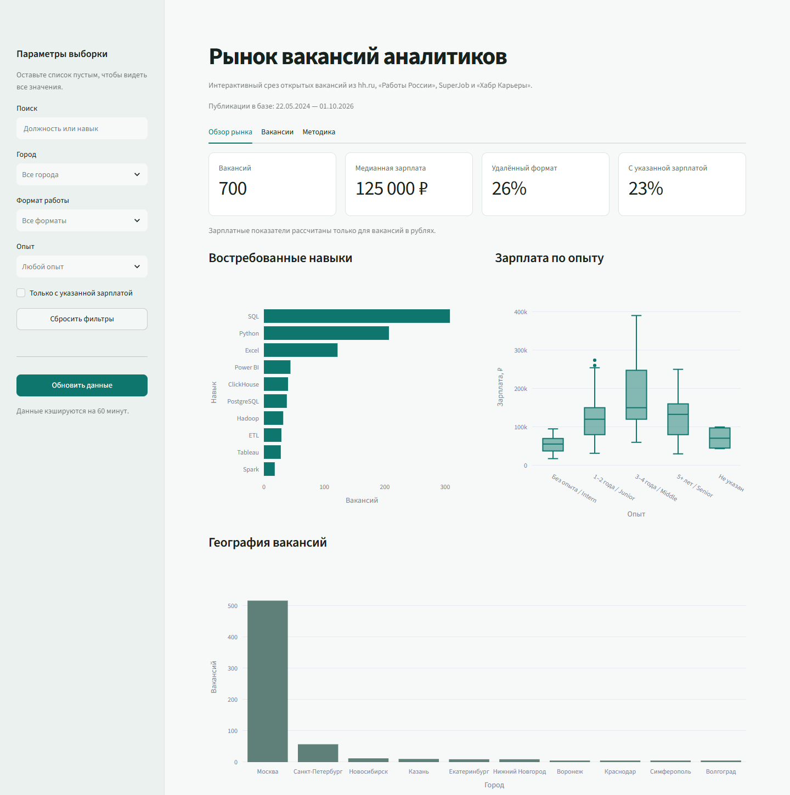

# Вакансии аналитиков: интерактивный обзор рынка

Я создал дашборд, который собирает вакансии аналитиков с нескольких площадок и помогает сравнивать требования работодателей. В одном интерфейсе можно посмотреть востребованные навыки, зарплатные предложения, географию и долю удалённой работы, а затем перейти к конкретным вакансиям.

Проект показывает полный путь работы с данными: от получения и очистки вакансий до хранения в базе, расчёта показателей и интерактивной визуализации.



## Зачем я сделал проект

Вакансии аналитиков опубликованы на разных сайтах, а названия должностей, требования к опыту и форматы работы описаны по-разному. Мне хотелось собрать сопоставимую выборку и сделать инструмент, с которым можно изучать предложения по выбранному городу, опыту или навыку.

Дашборд помогает ответить на практические вопросы:

| Вопрос | Где смотреть |
| --- | --- |
| Какие навыки чаще встречаются в выбранных вакансиях? | График востребованных навыков |
| Как различаются зарплатные предложения по требуемому опыту? | График зарплат и вкладка «Методика» |
| В каких городах опубликованы подходящие вакансии? | География и фильтр по городу |
| Какие предложения подходят под конкретный запрос? | Поиск, фильтры и таблица со ссылками на вакансии |

## Что есть в дашборде

Интерфейс разделён на три вкладки:

- **Обзор рынка**: количество вакансий в выборке, медианная оценка зарплаты, доля удалённого формата, полнота зарплатных данных и три графика
- **Вакансии**: таблица с должностью, городом, опытом, форматом работы, навыками, оценкой зарплаты и ссылкой на публикацию
- **Методика**: правила расчёта показателей и сводная таблица зарплат по опыту

Поиск работает по названию вакансии и навыкам. Выборку можно ограничить городом, форматом работы, опытом и наличием указанной зарплаты. Все показатели и графики пересчитываются для выбранных вакансий.

## Как я работал с данными

1. Получаю вакансии из [hh.ru](https://api.hh.ru/openapi/redoc), [«Работы России»](https://trudvsem.ru/), [SuperJob](https://api.superjob.ru/) и публичного каталога [«Хабр Карьеры»](https://career.habr.com/). Для некоторых API нужны ключи доступа; открытые источники можно загрузить отдельно.
2. Привожу поля разных площадок к общей структуре: название, город, опыт, формат работы, зарплата, навыки, дата публикации и ссылка. При отображении объединяю варианты названий городов и группирую требования к опыту по общей шкале.
3. Сохраняю вакансии в PostgreSQL. Повторная загрузка обновляет запись по идентификатору вакансии и источника, не создавая её копию.
4. Рассчитываю показатели в Python и показываю их в Streamlit. GitHub Actions настроен на ежедневный запуск загрузчиков.

Основные инструменты: **Python**, **pandas**, **PostgreSQL**, **SQLAlchemy**, **Streamlit**, **Plotly**, **GitHub Actions** и **Render**. Код загрузчиков находится в `*_etl.py`, модель данных и запись в базу в `db.py`, интерфейс в `app.py`. Проверки преобразований и расчётов находятся в `tests/`.

## Как читать результаты

Зарплатное предложение оценивается как середина указанной вилки. Если указана одна граница, используется её значение. Зарплатные графики и медиана учитывают только вакансии с суммами в рублях. Это оценка предложения в объявлении, а не фактическая зарплата сотрудника.

Данные отражают собранную выборку, а не весь рынок труда. Источники могут не указывать зарплату или навыки; старые записи пока не помечаются как закрытые. Поэтому число вакансий в дашборде нельзя трактовать как число всех актуальных открытых позиций.

## Запуск проекта

Для просмотра полной выборки нужна строка подключения к PostgreSQL с загруженными вакансиями. Для Neon используйте **Connect → Connection string** с включённым pooling, а не адрес REST API. Сохраните её как `DATABASE_URL` в `.env` в корне проекта. Команды ниже рассчитаны на PowerShell и Python 3.11+:

```powershell
python -m venv .venv
.\.venv\Scripts\python.exe -m pip install -r requirements.txt
.\start-dashboard.cmd
```

После запуска откройте `http://localhost:8501`. Настройка источников, запуск с собственной базой, деплой и проверочные SQL-запросы описаны в [техническом руководстве](docs/DEVELOPMENT.md).
